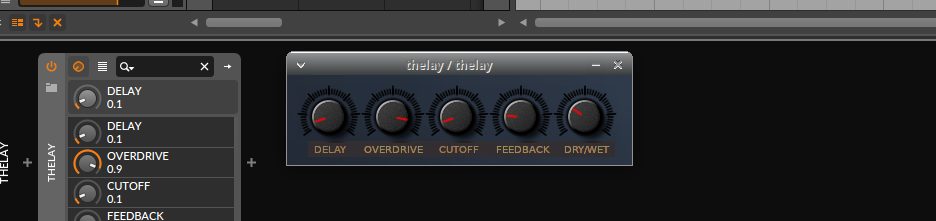

# ikiGUI
The smallest cross platform audio plugin GUI library availible. Is about 520 lines of code in total. With a minimum of dependencies, and uses only old standard system libraries for maximum compability.
- Cross compiles 100% identical code to Linux and Windows
- Uses no third party libraries.
- Super small code base
- Easy to animate graphics
- Easy to make columns or rows of knobs, buttons or even letters.
- Convenient for debuging, printing text and numbers directly on the plugin GUI.
- Uses 32bit pixels (24bit color and 8bit alpha channel).
- Optimized to be easy to learn and use.
- To be able to write incredibly fast loading plugins.
- Faster learing curve as C is many times easier language to learn than C++
- Faster deep knowledge to improve code base and do innovations by your own.
- Can make precalculated compositing of images.
Example code for using it can be found here... https://github.com/logos-maker/VST2

## Why on earth is it so small?
- So you have much less to learn to do a plugin.
- It's so you one day should understand all code.
- So you can add things yourself if needed.
- So it gets a lot less possible bugs. Ever heard of crashing audio plugins?
- So it gets very easy to port it to other languages and platforms.
- So the plugins opens much faster.
- So it uses the instruction CPU cache that is 50 times faster than RAM memory.

## GUI lib in C for iki graphics
It's a new cross platform audio plugin GUI library for tiled graphics with alpha channel and animations, that uses almost no code at all. 

It's currently availible to Windows and Linux, and selects the platform specific code automatically.

You can place graphic elements one by one or use character/tile maps (an old concept widely used in the 80's and in 2D computer games).
Tile maps it's a simple way to make columns and rows of knobs for example and animate them.

And it's well suited for displaying prerendered skeuomorphic or flat vector graphics or photos as plugin graphics, and gives 100% identical graphics for all platforms.

The name is a wordplay with the Japanese words 'iki' and 'ikigai', combined with GUI (Graphical User Interface).

## Reasons to use GUI lib for graphics
- Plugs that load and opens the editor incedibly fast.
- The small code base gives less bugs
- It's easy to understand and gain knowledge of what is actually happening.
- It's easy to modify
- It cross compiles with 100% identical code
- Easy to animate graphics
- Gives 24bit layered graphics with alpha channel

## What ikiGUI will do for you
- It lets you open audio plugin windows aka child windows.
- It gives you the mouse cursor position and buttons pressed (from your window object).
- It loads pictures that you embedd into your plugin (so your plugin is contained in one file).
- Lets you easily build layers of graphics with [alpha blending](https://en.wikipedia.org/wiki/Alpha_compositing),
built up of single graphical elements or arrays, rows and columns of pictures aka [tile maps](https://en.wikipedia.org/wiki/Text_mode) (for example knobs for your audio plugin).
- It can give you information about what tile (for example a knob or button) the mouse cursor is on.

## Quick overview of the stucts used in ikiGUI
```
ikigui_window // for making a window object
ikigui_image // for making a image data object
ikigui_map // for making a tile map and hold it's settings.
```

## Quick overview of all functions used in ikiGUI
```
ikigui_map_init()      // allocates memory and configures your tilemap.
ikigui_map_free()      // release memory allocated with ikigui_init()
ikigui_map_draw()      // draws the graphics tile map. According to ikigui_init()
ikigui_mouse_pos()     // Gives the index to the right element of a tile map from an x y coordinte.     

ikigui_blit_alpha()    // Blits a part of an image, with alpha channel over the destination graphic.
ikigui_blit_filled()   // Blits a part of an image, with a background color so the destination graphic gets overwritten.
ikigui_blit_fast()     // Blits a part of an image, without alpha channel.
ikigui_image_draw()    // Blits a whole image to the destination, without alpha channel.

ikigui_open_plugin_window()  // open a plugin window (child window) in the used DAW.
ikigui_get_events()          // gets the window events like mouseclicks and so on.
ikigui_update_window()       // updates the graphics in the plugin window.

ikigui_image_empty()    // Creates an empty image. Allocates memory.
ikigui_draw_gradient()  // Fill image with gradient. The source and destination is the same image.
ikigui_draw_solid()     // Fill an image with single color. The source and destination is the same image.    
ikigui_bmp_include()    // Imports BMP graphics that are included, to be used as graphics. Allocates memory.
ikigui_fill_bg()        // Draws a background color to an image. The source and destination is the same image.
```

## Roadmap
- Support for more platforms.
- Support usage in more languages.
- More functions for realtime drawing.
- Tutorials.
- More examples.
- Readymade graphics for easy usage.
- Tools for faster development and rapid GUI design.
- Better documentation.

## Tutorial on how to prepare graphics for a plug with ikiGUI
For your plug you probably whant background graphics as your front panel,
and some assets like knobs and other graphics that can change it's appearance during usage of your audio plug that will be on top of the background graphics. 

Your assets needs to be saved in a image format that supports alpha channel.
Alpha channel gives the possibility for transparent graphics for shadows and edges.
So your assets on top of the background will look right.

One good place to find free suitable knobs for your plug is [here.](https://www.g200kg.com/en/webknobman/gallery.php)
On that page, click on one knob you like and then press 'Easy Rendering'.
On the next screen press 'Export Exec'.
Right click on the .png image in your web-browser and save it if it doesn't get downloaded automatically.

Next you need to convert the PNG image to a BMP file.
Open the image in a program and export the image to a BMP file using ARGB formatting. After saving the image, you can convert it to a C-array that you can include in your project C code.
For conversion to a C-array, there is a program called asset_conv.c included in this repository if you don't have a program to do the job.

Then you also need a background image for your knobs to be displayed upon.
Use a external graphics program like Gimp or what you like to use.
And make your background color, text and everything you want visible on your front panel that has a static look.
It's good to make usage of layers when designing, so you can move and change separate things without problems. If you use layers, you can also try out your assets in the top layers in the graphics program.

Then when you are ready, you can then export it to a BMP image, all except your animated assets like knobs.
And then convert it to a c-array to include to your project, so your graphics will be embedded into your plug.

## Integrating other pixel based drawing routines
Maybe you want to be able to do other things with graphics that ikiGUI doesn't have out of the box.
Like drawing lines or vector graphics or image processing with colors or whatever.
Then this can quite easily be done, just get the base address for the pixels and the width and hight
of what you want to change and do what you need to do. All pixels are saved in a 32bit ARGB format.

If you want vector graphics maybe you could use something like...  
[Olive](https://github.com/tsoding/olive.c),  
[PlutoVG](https://github.com/sammycage/plutovg/tree/main)  
And here you can find a interesting video about image processing...  
[Video: How Blurs & Filters Work](https://youtu.be/C_zFhWdM4ic?si=F9bRqaaNlFn7qX06)

## What is a [tile map](https://en.wikipedia.org/wiki/Text_mode)?
A tile map is used to create a 2D grid of graphics. Examples of this is found everywhere in 80's computers and video games, and was used to display characters and build levels in computer games.
The tile map is stored in a array, where the first elements is the first row, followed by the second row and so on. And the first element is the upper left.
By changing the numbers in the array, you selects what graphical element to show in each position in the tile map. Historically this used built in graphics modes in the computers graphics chips.
And this tile map/character map told what character should be placed for every position of the intire screen.  

## How to create and make use of tile maps with ikiGUI
To have a place to put your graphics, need to define an object for a window. You simply do this by writing...
```
ikigui_window mywin ; // This will define an object called mywin. The name mywin is unique for your project.
```

Then you need graphics that you can use as a [texture atlas](https://en.wikipedia.org/wiki/Texture_atlas)
And you need a place for storing that image. You do this by writing...
```
ikigui_image knob_anim; // knob_anim is the name of the array that is in the included file knob.h
```

Then you need to fill the ikigui_frame with graphics. For that we prepare a BMP picture converted to an array, and then include that in your program.
You include this by writing...
```
#include "gfx/knob.h" // gfx is the catalog and knob.h is the file with the array of the BMP picture.
```

Then you need to read in that BMP picture, and get it’s width and hight. You do this by writing...
```
ikigui_bmp_include(&knob_anim,knob_array); // knob_array is the array found in knob.h
```

Then we need to have a tile map. You create one by writing...
```
ikigui_map knobs; // This will create a tile map called knobs. The name knobs is unique for your project.
```

Then we need to initialize that tile map with the graphical properties...
```
ikigui_map_init(&knobs, &mywin.frame,&knob_anim,5,1,64,56);
```
knobs is the tile map, 
mywin.frame is the destination, 
5 is the number of columns, 
1 is the number of rows,
64 is the width in pixels of each graphical object in the tile atlas,
56 is the hight if pixels of each graphical object in the tile atlas.

To draw the tile map to the window you write...
```
ikigui_map_draw(&knobs,0,10,10);
```
knobs is the tile map, 
0 is the drawing mode, 
10 x coordinate where to paint it, 
the next 10 is the y coordinate.

Then finally to display this tilemap and everything else in your plug that you have drawn to the window. You do this by writing...
```
ikigui_update_window(&mywin); 
```
## About the drawing modes of ikigui_map_draw()
It has 3 different drawing modes 0,1 and 2...
```
1. uses ikigui_blit_alpha() // Blits a part of an image, with alpha channel over the destination graphic
2. uses ikigui_blit_filled() // Blits a part of an image, with a background color so the destination graphic gets overwritten.
3. uses ikigui_blit_fast() // Blits a part of an image, without alpha channel.
```
## Compilation
On linux it compiles with GCC, Clang or TCC. But to compile on Windows you need to install GCC with MinGW-w64. And there is many ways to do that, but I recommend to use [TDM-GCC](https://jmeubank.github.io/tdm-gcc/articles/2021-05/10.3.0-release) as it's the simplest way to do it that I have found.
## Licences
The code will soon be dual-licensed for a small fee for closed source projects. More info later.

