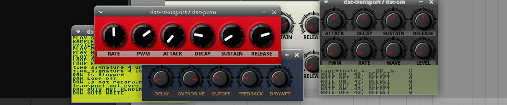

  
_A screenshot of a simple plugin example using ikiGUI_

# ikiGUI
The smallest cross platform GUI library for applications and audio plugins availible. And it doesn't use any third party libraries for the least amount of dependencies and easy compilation.

- Can be used for making audio plugin GUI's.
- Can be used to make stand alone applications (usefull for learning and trying out GUI designs).
- Cross compiles 100% identical code to Windows and Linux.
- 100% identical graphics for all supported platforms.
- It selects the platform specific code automatically.
- For self contained plugs, with no external files.
- Require no build system for compilation.
- It sets up a A8R8G8B8 framebuffer (also known as ARGB8888) for the entire plugin window.
- Uses 32bit pixels (24bit color and 8bit alpha channel).
- Can make precalculated compositing of images with transparancy.
- Super small code base
- Makes it easy to animate graphics.
- Makes it easy to make columns and rows of knobs, buttons or monospace letters.
- Can be used with C or C++
- Has compilation flag to strip away 100% of all platform depentant code.
- Can be used with doxygen for automatic generation of documentation.
- Can generate and draw text with TTF True Type fonts.
    
Example code for using it making audio plugins can be found here... https://github.com/logos-maker/RST

## ikiGUI Graphics/GUI lib in C
It's a cross platform, graphics library for tiled graphics with alpha channel and animations, that uses almost no code at all.
It can be used for audio plugins (it doesn't use static or global variables that will mess up your programs).

Include ikigui.h to your project for usage. Easy to test out by making standalone applications...
#define IKIGUI_STANDALONE before #include 'ikigui.h'

You can place graphic elements one by one or use character/tile maps (an old concept widely used in the 80's and in 2D computer games).
Tile maps it's a simple way to make columns and rows of knobs for example and animate them.

And it's well suited for displaying prerendered skeuomorphic or flat vector graphics or photos as plugin graphics, and gives 100% identical graphics for all platforms.

The name is a wordplay with the Japanese words 'iki' and 'ikigai', combined with GUI (Graphical User Interface).

## Reasons to use GUI lib for graphics
- Possible to use without any OS or library related dependencies other than standard C lib
- Simple cross platform compilation with 100% idental code
- Small code base gives less bugs
- It's easy to modify
- Plugs that load and opens the editor incedibly fast.
- It's easy to understand and gain knowledge of what is actually happening.
- Easy to animate graphics
- Gives 24bit layered graphics with alpha channel
- Easier to find stuff with code-competion in text editors
- Usage of doxygen for help in text editors with autocompletion
- Consequent naming and parameter order in the API to make easier to remeber and to understand

## What ikiGUI will do for you
- It lets you open audio plugin windows aka child windows (can open main windows also for stand alone applications)
- It gives you the mouse cursor position and buttons/knobs/tiles pressed (from your window object).
- It loads pictures that you embedd into your plugin (so your plugin is contained in one file).
- Lets you easily build layers of graphics with [alpha blending](https://en.wikipedia.org/wiki/Alpha_compositing),
built up of single graphical elements or arrays, rows and columns of pictures aka [tile maps](https://en.wikipedia.org/wiki/Text_mode) (for example knobs for your audio plugin).
- It can give you information about what tile (for example a knob or button) the mouse cursor is on.

## Quick overview of the stucts used in ikiGUI
```
ikigui_window // for making a window object
ikigui_image // for making a image data object
ikigui_map // for making a tile map and hold it's settings.
```

## Quick overview of functions used in ikiGUI
```
ikigui_map_init()      // allocates memory and configures your tilemap.
ikigui_map_free()      // release memory allocated with ikigui_init()
ikigui_map_draw()      // draws arrays of graphics tiles as a tile map. According to the ikigui_map setup with ikigui_map_init()
ikigui_mouse_pos_map()     // Gives the index to the right element of a tile map from an x y coordinte.     

ikigui_tile_alpha()    // Blits a part of an image, with alpha channel over the destination graphic.
ikigui_tile_filled()   // Blits a part of an image, with a background color for the graphics moved.
ikigui_tile_fast()     // Blits a part of an image, without alpha channel so you get a image composition.
ikigui_tile_hollow()   // Blits a part of an image, with the source alpha channel replacing the souce color but keeping alpha.
ikigui_draw_gradient() // Draws a color gradient, on a part of the destinon image or the editor window.
ikigui_draw_image()    // Draws a whole image to the destination image or editor window (without alpha channel).
ikigui_draw_composite()// draws a whole image to the destination image or editor window (with alpha channel).

ikigui_window_open_editor()  // open a plugin window (child window) in the used DAW.
ikigui_window_get_events()   // gets the window events like mouseclicks and so on.
ikigui_window_update()       // updates the graphics in the plugin window.

ikigui_image_make()    // Creates an empty image. Allocates memory.
ikigui_image_free()     // To realease memory allocated by ikigui_include_bmp() or ikigui_image_create()
ikigui_image_gradient() // Fill image with gradient. The source and destination is the same image.
ikigui_image_solid()    // Fill image with single color. Usefull if you create images with the ikigui_image_create() function.    
ikigui_image_solid_bg() // Draws a background color to an image. The source and destination is the same image.

ikigui_include_bmp()    // Imports BMP graphics from include file, to a ikigui_image. Allocates memory.
```

## Roadmap
- Load and save BMP and PNG images (near future).
- Open native load and save dialogs (near future).
- More functions for realtime drawing (2024).
- Better documentation (2024).
- Readymade graphics for easy usage (2024).
- Adopt version control when the API interface for ikiGUI is stable (2024).
- Better support for TTF True Type fonts for realtime usage (2024).
- Support for 'embeddedd systems'/'stand alone hardware'(2025).
- Tools for faster development and rapid GUI design (2025).
- Support usage in more languages  (bindings for Python or maybe Lua and Wren, 2025).

## Tutorial on how to prepare graphics for a plug with ikiGUI
For your plug you whant background graphics that you can think of as your front panel,
and some assets like knobs and other graphics that can change it's appearance during usage of your audio plug that will be on top of the background graphics. 

Your assets needs to be saved in a image format that supports alpha channel.
Alpha channel gives the possibility for transparent graphics for shadows and edges.
That will assure that your assets like knobs and switches on top of the background will look right.

One good place to find free suitable knobs for your plug is [here.](https://www.g200kg.com/en/webknobman/gallery.php)
On that page, click on one knob you like and then press 'Easy Rendering'.
On the next screen press 'Export Exec'.
Right click on the .png image in your web-browser and save it if it doesn't get downloaded automatically.

Next you need to convert the PNG image to a BMP file.
Open the image in a program and export the image to a BMP file using A8R8G8B8 formatting. After saving the image, you can convert it to a C-array that you can include in your project C code.
For conversion to a C-array, there is a program called asset_conv.c included in this repository if you don't have a program to do the job.

Then you also need a background image for your knobs to be displayed upon.
Use a external graphics program like Gimp or what you like to use.
And make your background color, text and everything you want visible on your front panel that has a static look.
It's good to make usage of layers when designing, so you can move and change separate things without problems. If you use layers, you can also try out your assets in the top layers in the graphics program.
The lib can also make image composition if you need to move stuff in your interface while developing.

Then when you are ready, you can then export it to a BMP image, all except your animated assets like knobs.
And then convert it to a c-array to include to your project, so your graphics will be embedded into your plug.

## Integrating other pixel based drawing routines
Maybe you want to be able to do other things with graphics that ikiGUI doesn't have out of the box.
Like drawing vector graphics, text or whatever.
This can quite easily be done, just get the base address for the pixels and the width and hight
of what you want to change and do what you need to do. All pixels are saved in a 32bit ARGB format.

If you want vector graphics maybe you could use something like...  
[PlutoVG](https://github.com/sammycage/plutovg/tree/main)
[Cairo](https://www.cairographics.org/)
And here you can find a interesting video about image processing...  
[Video: How Blurs & Filters Work](https://youtu.be/C_zFhWdM4ic?si=F9bRqaaNlFn7qX06)

## What is a [tile map](https://en.wikipedia.org/wiki/Text_mode)?
A tile map is used to create a 2D grid of graphics. Examples of this is found everywhere in 80's computers and video games, and was used to display characters and build levels in computer games.
The tile map is stored in a array, where the first elements is the first row, followed by the second row and so on. And the first element is the upper left.
By changing the numbers in the array, you selects what graphical element to show in each position in the tile map.

## How to create and make use of tile maps with ikiGUI
To have a place to put your graphics, need to define an object for a window. You simply do this by writing...
```
ikigui_window mywin ; // This will define an object called mywin. The name mywin is unique for your project.
```

Then you need graphics that you can use as a [texture atlas](https://en.wikipedia.org/wiki/Texture_atlas)
And you need a place for storing that image. You do this by writing...
```
ikigui_image knob_anim; // knob_anim is the name of the array that is in the included file knob.h
```

Then you need to fill the ikigui_frame with graphics. For that we prepare a BMP picture converted to an array, and then include that in your program.
You include this by writing...
```
#include "gfx/knob.h" // gfx is the catalog and knob.h is the file with the array of the BMP picture.
```

Then you need to read in that BMP picture, and get it’s width and hight. You do this by writing...
```
ikigui_include_bmp(&knob_anim,knob_array); // knob_array is the array found in knob.h
```

Then we need to have a tile map. You create one by writing...
```
ikigui_map knobs; // This will create a tile map called knobs. The name knobs is unique for your project.
```

Then we need to initialize that tile map with the graphical properties...
```
ikigui_map_init(&knobs, &mywin.frame,&knob_anim,0,0,0,64,56,5,1);
```
knobs is the tile map, 
mywin.frame is the destination, 
5 is the number of columns, 
1 is the number of rows,
64 is the width in pixels of each graphical object in the tile atlas,
56 is the hight if pixels of each graphical object in the tile atlas.
And 0,0,0, is an tile offset (that can be used for writing text) followed by a custom y z distance between tiles in pixels if not set to zero.

To draw the tile map to the window you write...
```
ikigui_map_draw(&knobs,0,10,10);
```
knobs is the tile map, 
0 is the drawing mode, 
10 x coordinate where to paint it, 
the next 10 is the y coordinate.

Then finally to display this tilemap and everything else in your plug that you have drawn to the window. You do this by writing...
```
ikigui_window_update(&mywin); 
```
## How to display text for LCD emulation or debugging
You can do this the same way that you can display arrays of knobs, you can make arrays of monospace characters.
This can be very usefull for emulating LCD screens easily for example or for displaying numbers and messages in your plugin editor window when developing.
It is done in a similar way that character maps was used in computers and videogames in the 80's.
The first part of the image should be space followed by ! and " in the same order as in the ASCII standard.
Then you can use the standard C lib to write text into your character map.
This can also be used for making tracker editors for sequencers.

## About the drawing modes of ikigui_map_draw()
It has 4 different drawing modes ...
```
TILE_ALPHA uses ikigui_tile_alpha() // Blits a part of an image, with alpha channel over the destination graphic
TILE_FILLED uses ikigui_tile_filled() // Blits a part of an image, with a background color so the destination graphic gets overwritten.
TILE_FAST uses ikigui_tile_fast() // Blits a part of an image, without alpha channel.
TILE_HOLLOW uses ikigui_tile_hollow() // Blits a part of an image, with alpha channel overwiting the source color, but uses it's alpha information.
```
## Compilation
On linux it compiles with GCC, Clang or TCC. But to compile on Windows you need to install GCC with MinGW-w64. And there is many ways to do that, but I recommend to use [TDM-GCC](https://jmeubank.github.io/tdm-gcc/articles/2021-05/10.3.0-release) as it's the simplest way to do it that I have found.
## Licences
The code will soon be dual-licensed for a small fee for closed source projects. More info later.

